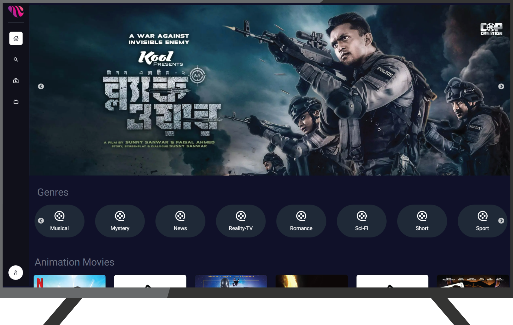
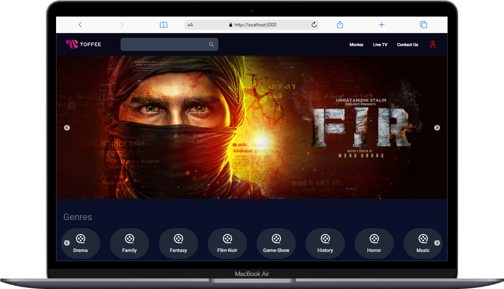
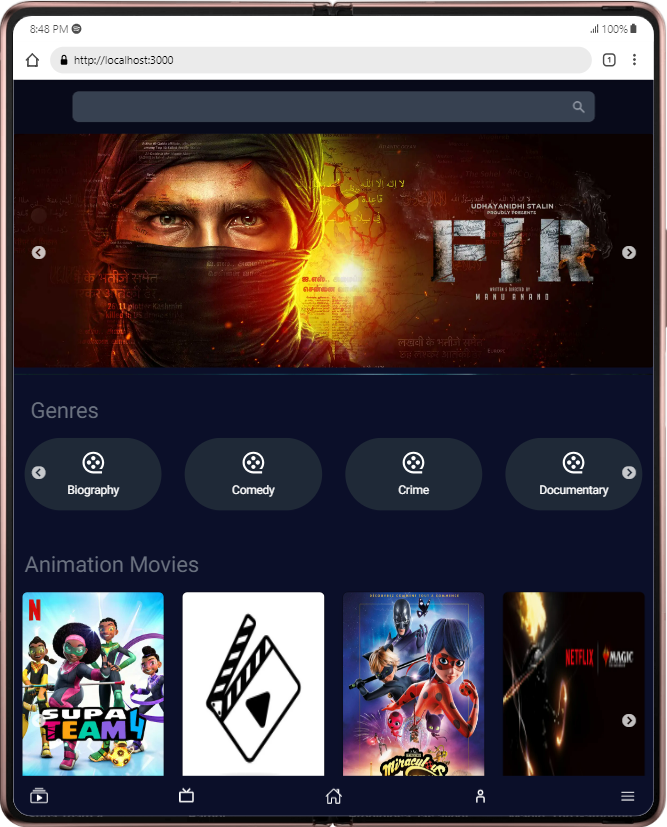
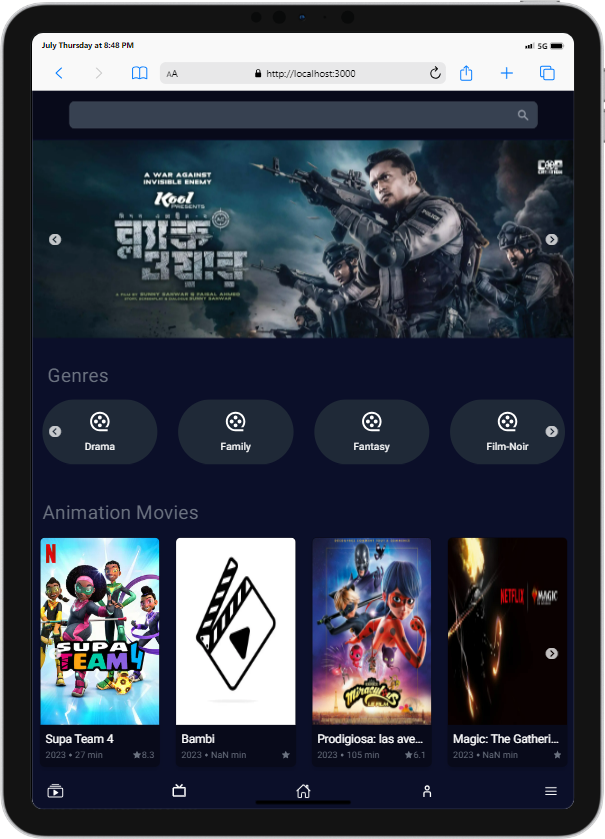
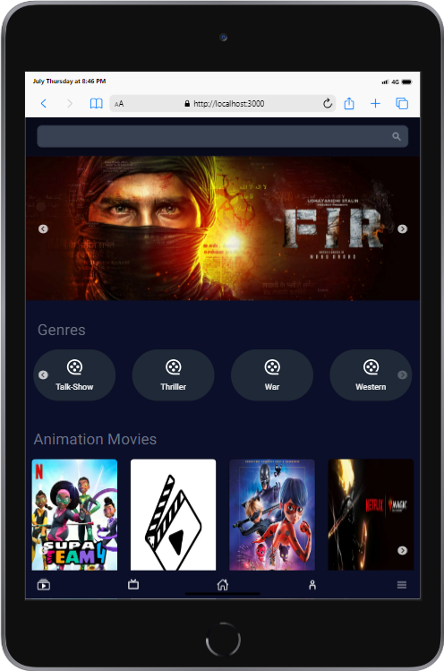
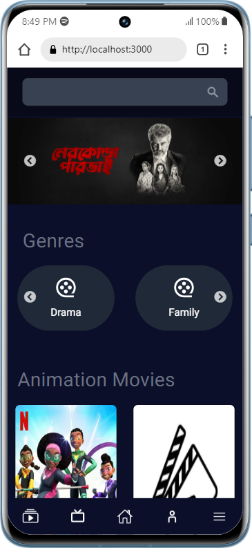
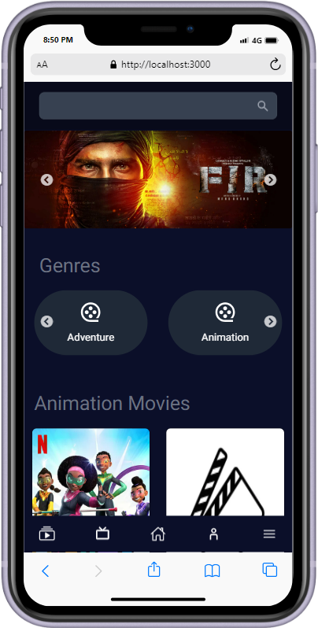
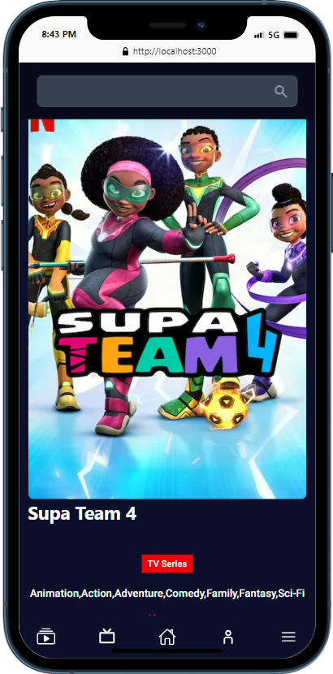
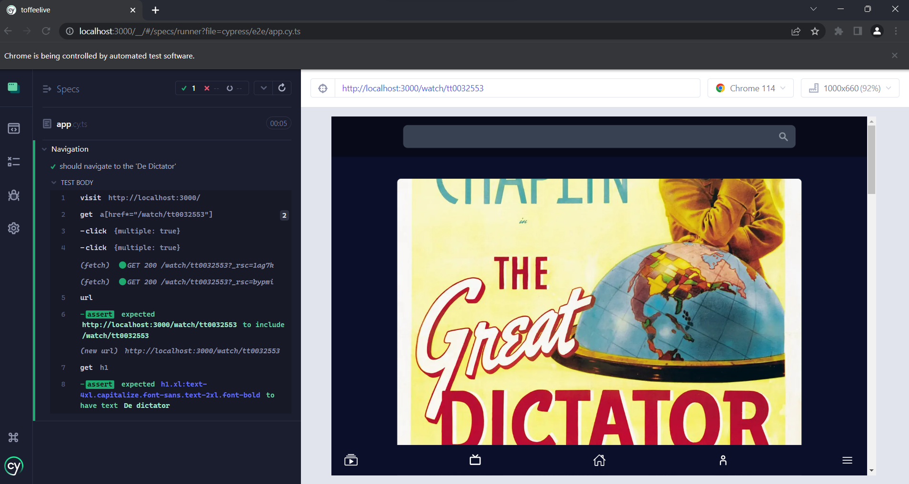
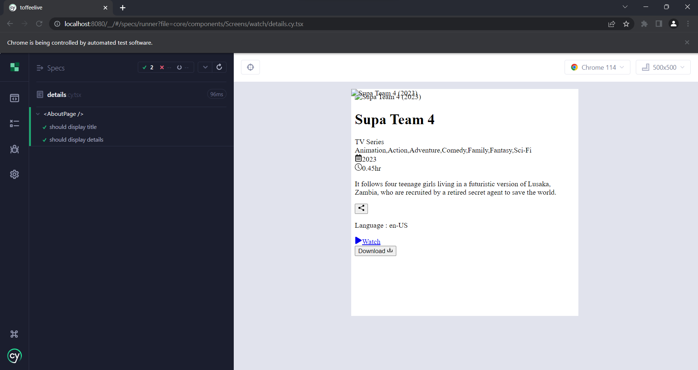

This is a `OOT application` developed using NextJS 13.4 and using `RapidAPI` open API

## Getting Started

First, Install Dependencies run the commend:

```bash
npm i
# or
yarn add
# or
pnpm i
```

Now Run this command in development server

```bash
npm run dev
# or
yarn dev
# or
pnpm dev
```

Open [http://localhost:3000](http://localhost:3000) with your browser to see the result.

Here is test case command

```bash
# End To End test
npm run e2e
# or
yarn e2e

# Component based test
npm run component
# or
yarn component
```

This application comfortable with all devices like **All TVs**, **Desktop**, **Tablets**, **All Mobiles**

## Here is some screenshot

### Television



### Desktop



### Tablet

  

### Mobile



### Testing

**E2E Testing**

**Unit Testing**

